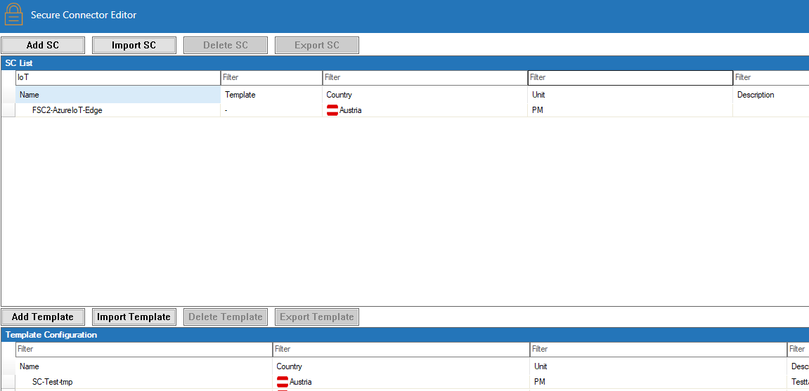
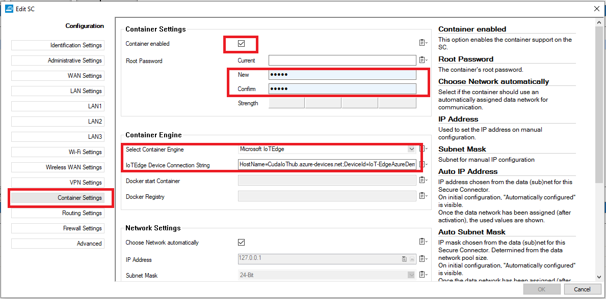
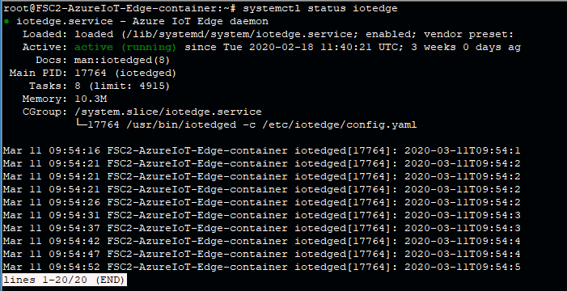

Run a simple python sample on Barracuda Secure Connector 2 Container device running Debian 9 stretch.
===
---

# Table of Contents

-   [Introduction](#Introduction)
-   [Step 1: Prerequisites](#Prerequisites)
-   [Step 2: Prepare your Device](#PrepareDevice)
-   [Step 3: Manual Test for Azure IoT Edge on device](#Manual)
-   [Step 4: Run a simple Python sample on Barracuda Secure Connector](#Sample)


<a name="Introduction"></a>
# Introduction

**About this document**

This document describes how to connect Barracuda Secure Connector 2 device running Debian 9 stretch with Azure IoT Edge Runtime pre-installed and Device Management. This multi-step process includes:

-   Configuring Azure IoT Hub
-   Registering your IoT device
-   Build and Deploy client component to test device management capability 

<a name="Prerequisites"></a>
# Step 1: Prerequisites

You should have the following items ready before beginning the process:

-   [Prepare your development environment][setup-devbox-linux]
-   [Setup your IoT hub](https://account.windowsazure.com/signup?offer=ms-azr-0044p)
-   [Provision your device and get its credentials][lnk-manage-iot-hub]
-   [Sign up to IOT Hub](https://account.windowsazure.com/signup?offer=ms-azr-0044p)
-   [Add the Edge Device](https://docs.microsoft.com/en-us/azure/iot-edge/quickstart-linux)
-   [Add the Edge Modules](https://docs.microsoft.com/en-us/azure/iot-edge/quickstart-linux#deploy-a-module)
-   Barracuda Secure Connector 2 device.
-   Set-up your Barracuda SC infrastructure via:
    -   Barracuda IoT Connect (https://campus.barracuda.com/product/cloudgenfirewall/doc/90443963/barracuda-iot-connect/), or
    -   using Git-hub templates for setting up Barracuda Control Center, Access Controller and CloudGen Firewall (https://github.com/barracudanetworks/ngf-azure-templates/tree/master/contrib/CGF-Custom-CC-SAC-CGF)

<a name="PrepareDevice"></a>
# Step 2: Prepare your Device

Barracuda Secure Connector is a centrally managed device and needs following additional products to run: (1) Barracuda Firewall Control Center for configuration and management and (2) Barracuda Secure Access Controller as the VPN hub for all your Secure Connector appliances. Barracuda offer two options to set-up the SC infrastructure:
-   Barracuda IoT Connect, please visit https://campus.barracuda.com/product/cloudgenfirewall/doc/90444698/get-started-with-barracuda-iot-connect/
-   Custom Secure Connector Azure deployment, please visit https://campus.barracuda.com/product/cloudgenfirewall/doc/91128292/barracuda-secure-connector/

When your infrastructure is up and running and you have your first Secure Connector appliance connected please enable
pre-installed Microsoft Azure IoT Edge Components in your Barracuda Firewall Control Center:
-   Go to Secure Connector Editor and open configuration of an individual SC or a SC template
    
-   In the Secure Connector configuration go to Container Settings.
-   Enable Container
-   Define root password for container
-   Choose Microsoft IoTEdge as your container engine
-   Enter the IoTEdge Device Connection String
    


<a name="Manual"></a>
# Step 3: Manual Test for Azure IoT Edge on device

This section walks you through the test to be performed on the Edge devices running the Linux operating system such that it can qualify for Azure IoT Edge certification.

<a name="Step-3-1-IoTEdgeRunTime"></a>
## 3.1 Edge RuntimeEnabled (Mandatory)

**Details of the requirement:**

The following components come pre-installed or at the point of distribution on the device to customer(s):

-   Azure IoT Edge Security Daemon
-   Daemon configuration file
-   Moby container management system
-   A version of `hsmlib` 

*Edge Runtime Enabled:*

**Check the iotedge daemon command:** 

Open the command prompt on your IoT Edge device , confirm that the Azure IoT edge Daemon is under running state

    systemctl status iotedge

 

Open the command prompt on your IoT Edge device, confirm that the module deployed from the cloud is running on your IoT Edge device

    sudo iotedge list

  

On the device details page of the Azure, you should see the runtime modules - edgeAgent, edgeHub and tempSensor modueles are under running status

 

<a name="Sample"></a>
## 4 Run a python sample

**Pre-requisites:** Device Connectivity.

## 4.1 Build SDK and sample:

- Open a PuTTY (or SSH) session and connect to the device
- Install the prerequisite packages for the Microsoft Azure IoT Device SDK for Python by issuing the following commands from the command line on your Secure Connector:
```
    apt-get update & apt-get upgrade
    apt-get install -y curl libcurl4-openssl-dev build-essential cmake git python2.7-dev libboost-python-dev
```
- Download the Microsoft Azure IoT Device SDK to the board by issuing the following command on the Secure Connector:
```
git clone --recursive https://github.com/Azure/azure-iot-sdk-python.git
```
- Install pip package manager:
```
    curl https://bootstrap.pypa.io/get-pip.py -o get-pip.py
    python3 get-pip.py
```
- Install Azure IoT Device SDK:
``` 
    pip install azure-iot-device
```
- Navigate to samples folder by executing following command:
```
    cd azure-iot-sdk-python/device/samples/
```
- Configfure connection string for sample code:
```
    export IOTHUB_DEVICE_CONNECTION_STRING="<your connection string here>"
```
- Run the python sample:
```
    python3 simple_send_message.py
```
- You schould see the massege ios scessfully send to Azure IoT Hub:


[setup-devbox-linux]: https://github.com/Azure/azure-iot-sdk-c/blob/master/doc/devbox_setup.md
[lnk-setup-iot-hub]: ../setup_iothub.md
[lnk-manage-iot-hub]: ../manage_iot_hub.md
